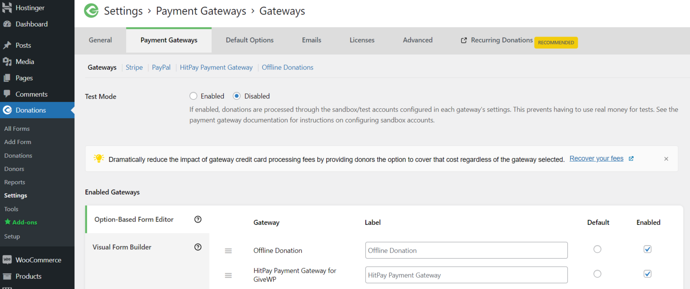
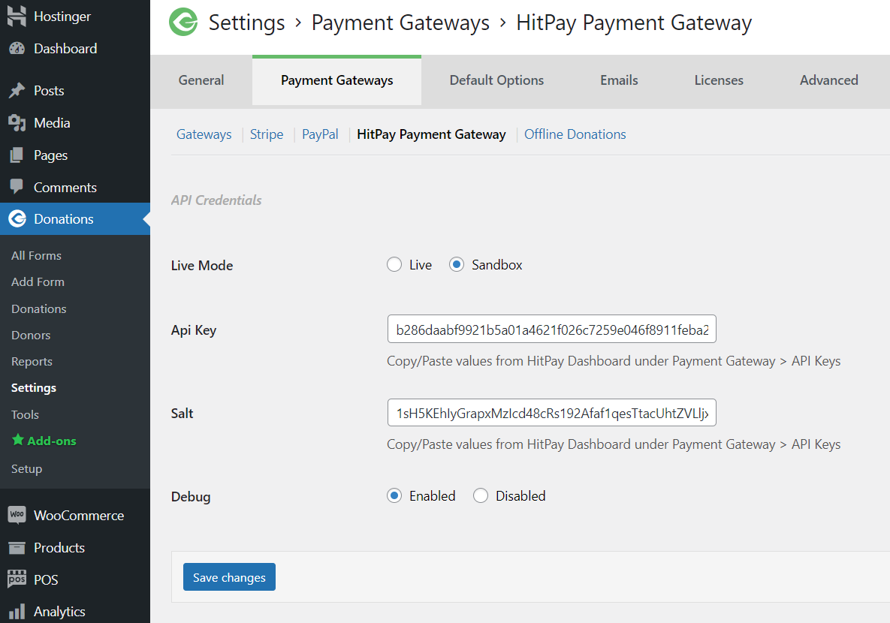
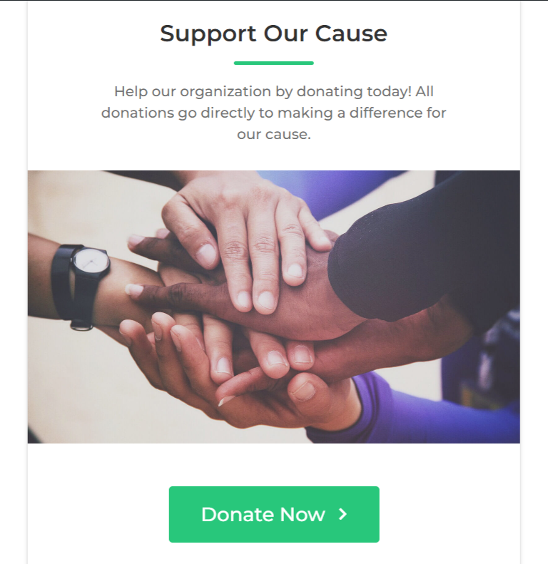
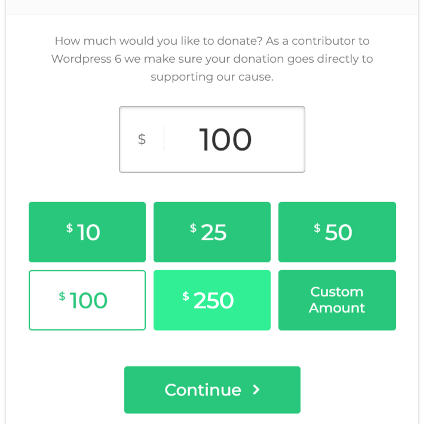
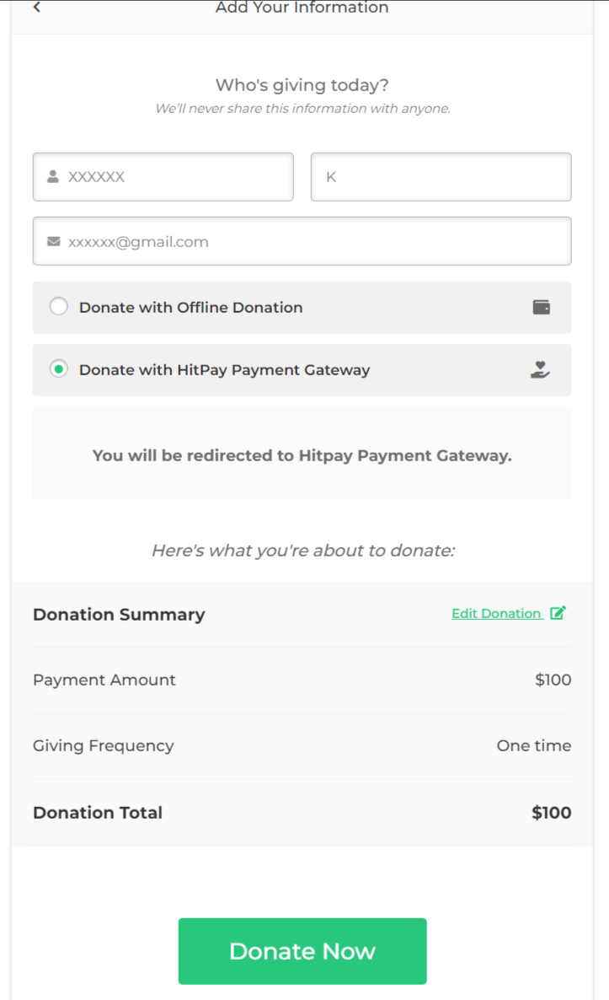
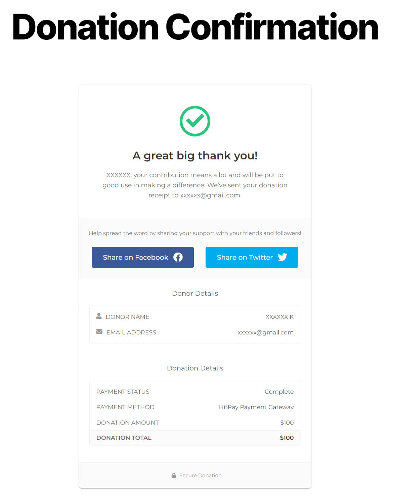
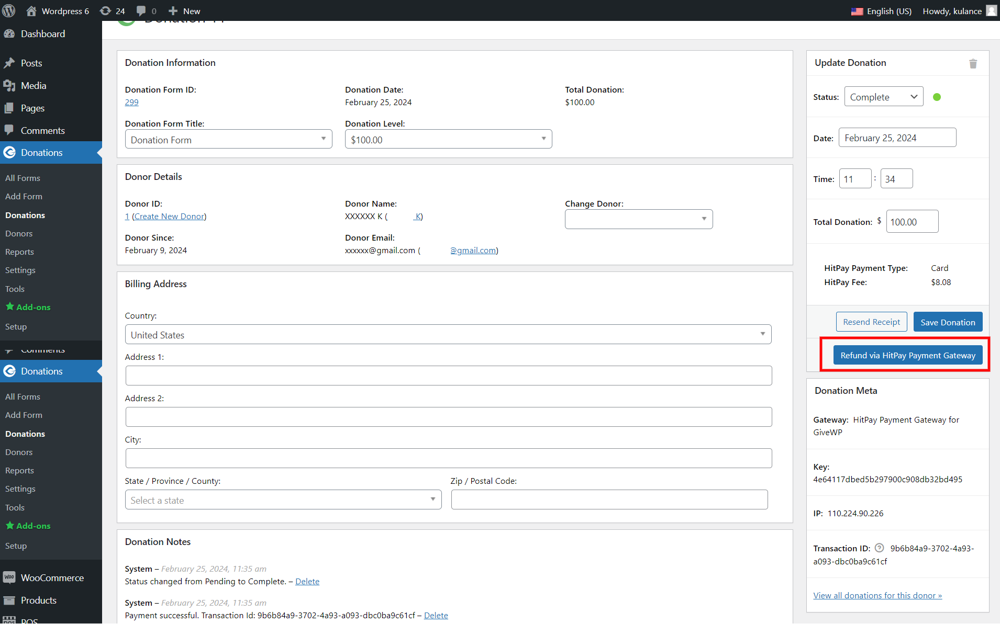
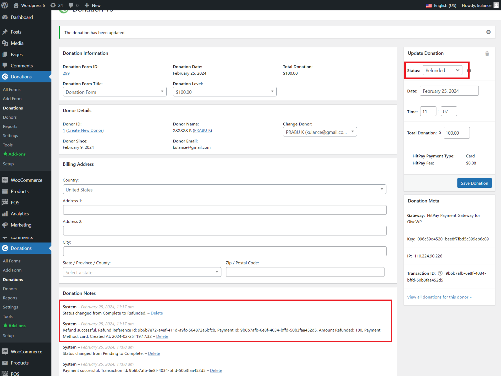

# HitPay 

== HitPay Payment Gateway for GiveWP ==

== Description ==

HitPay Payment Gateway for GiveWP Plugin allows merchants to accept donations via PayNow QR, Cards, Apple Pay, Google Pay, WeChatPay, AliPay and GrabPay Payments

This plugin would communicate with 3rd party HitPay payment gateway(https://www.hitpayapp.com/) in order to process the payments.

Merchant must create an account with HitPay payment gateway(https://www.hitpayapp.com/).

Pay only per transaction. No monthly, setup, admin or any hidden service fees.

Merchant once created an account with HitPay payment gateway(https://www.hitpayapp.com/), they can go to thier HitPay dashboard and choose the payment options they would to avail for their site.

And merchant need to copy the API keys and Salt values from the HitPay Web Dashboard under Settings > Payment Gateway > API Keys

== Installation ==

= Using The WordPress Dashboard =

1. Navigate to the 'Add New' in the plugins dashboard
2. Search for 'HitPay Payment Gateway for GiveWP'
3. Click 'Install Now'
4. Activate the plugin on the Plugin dashboard

= Uploading in WordPress Dashboard =

1. Navigate to the 'Add New' in the plugins dashboard
2. Navigate to the 'Upload' area
3. Select `hitpay-payment-gateway-for-givewp.zip` from your computer
4. Click 'Install Now'
5. Activate the plugin in the Plugin dashboard

= Using FTP =

1. Download `hitpay-payment-gateway-for-givewp.zip`
2. Extract the `hitpay-payment-gateway-for-givewp` directory to your computer
3. Upload the `hitpay-payment-gateway-for-givewp` directory to the `/wp-content/plugins/` directory
4. Activate the plugin in the Plugin dashboard

== Configuration ==

1. Go to Donations settings
2. Select the "Payment Gateways" tab
3. Activate the payment method (if inactive) in the Option-Based Form Editor by ticking the Enabled checkbox field
4. Set the name you wish to show your users on Checkout (for example: "HitPay or Creditcard") in the label input field
5. Click the link 'HitPay Payment Gateway' under the tabs
6. Copy the API keys and Salt values from the HitPay Web Dashboard under Settings > Payment Gateway > API Keys
7. Click "Save Changes"

== Donation ==

== Refunds ==

1. Log in to Admin
2. Navigate to Donations ⇒ Donations
3. Click edit link to navigate to Donation Payment Details page
4. If donation is paid via 'HitPay Payment Gateway' then the button 'Refund via HitPay Payment Gateway' will be displayed as attached screen:

5. If gateway accepted the refund request and the Refund details will be added to donation payment note.
6. Only one refund is allowed per transaction.
7. Refund is only applicable if the initial charge was made with PayNow or Card.

== Changelog ==

= 1.0.0 =
* Initial release.
